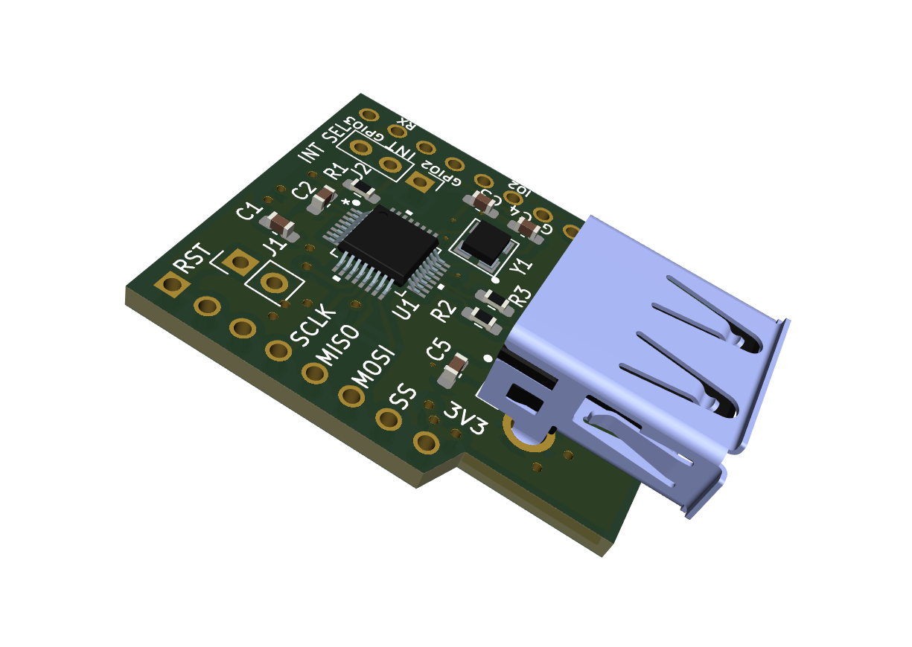
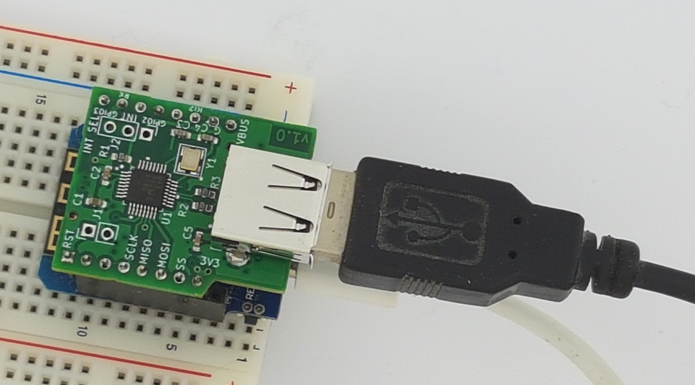

# The ESP8266 USB Host Shield

The USB Host Shield contains all of the digital logic necessary to implement a full-speed USB 2.0 host controller with your ESP8266 microcontroller.

## USB Host + WiFi for microcontrollers 

Add WiFi and the ESP8266 USB host shield and control network devices wireless with standard USB HID devices like a keyboard, mouse, and game controller.
 
An `ESP8266 D1-mini` and the super easy `ESP8266 USB Host Shield` will let you control other WiFi devices wireless without being forced to dedicate an entire computer for such tasks. 

Use the host shield and, for example, a `gaming joystick` to interface with and remotely control `within the capabilities` of the [USB Host Shield 2.0 Library](https://github.com/felis/USB_Host_Shield_2.0/), any microcontroller-based device with WiFi.

## Board main features

The host controller MAX4321E chip uses a four-wire serial interface to communicate with ESP8266. A USB type A female connector supplies 5V as any regular USB port would do. The SPI of 26MHz is fast; forget any sluggish UART communication.

- The shield supplies any attached devices with +5V (VBUS) via the connected ESP8266 USB connector.
- With the ESP8266 USB host shield, there is no risk of wiring it up incorrectly.
- This device comes fully assembled, and there is no need to program the shield itself.
- SPI bus voltage levels are 3.3V, thus compatible with modern microcontrollers.
- The host complies with USB Specification Revision 2.0, i.e., full-/low-Speed 12Mbps/1.5Mbps USB communication.
- The ESP8266 board power the shield and the MAX3421E with 3.3V.

The additional built-in GPIO pins from MAX3421E are not connected, and some other signals with the limited availability of pins on the ESP8266 D1-mini. See the `schematic` for all details. The Arduino library is for another shield implementation with `MAX3421E`, so certain aspects may not work exactly as in the example sketches. However, we have found that most HID devices are generally recognized.

## Suggested items to add to the board

- Wemos/Lolin ESP8266 D1-mini microcontroller.
- Female headers for ESP8266 D1-mini.
- HID devices such as keyboards, mice, gaming joysticks, etc.

Various sellers sell ESP8266 cloned boards on `AliExpress` and `Amazon`. Alternatively, buy the original version of ESP8266 D1-mini at [Lolin](https://lolin.aliexpress.com/store/1331105) official shop.

## Usage

Add the shield board on top of the ESP8266 D1-mini such that both USB connectors are above each other. 

- Confirm that the shield cut-out is above the ESP8266 `RESET button` before connecting power! 

Please, see the [Arduino library installation documentation](https://docs.arduino.cc/software/ide-v1/tutorials/installing-libraries), and how-to install the Arduino library [USB Host Shield 2.0](https://github.com/felis/USB_Host_Shield_2.0/).

Verify that the USB host shield library can use the device with the Arduino sketch `USBHID_desc`, found among the many examples.

## Specification for the `ESP8266 USB Host Shield v1.0`

* Operating voltage: 3.3V - (via ESP8266)
* The shield size is 26.5 x 31.5 mm (1.04" x 1.24") and fabricated as a four-layer board for superior signal integrity.
* Board thickness: 1.6 mm (63 mils).
* Formfactor and pinout: Wemos/Lolin ESP8266 D1-mini.
* Weight: 6 gram (0.21 ounce).
* Height: 17.5 mm (0.69")

## Purchase the board

The `ESP8266 USB Host Shield` board is available only fully assembled. `Tindie` has all the latest designed boards.

I appreciate your support.